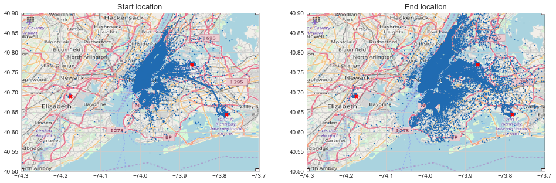
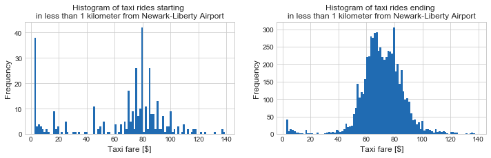
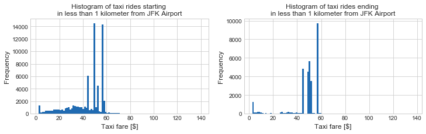
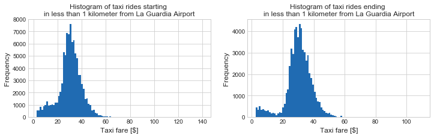
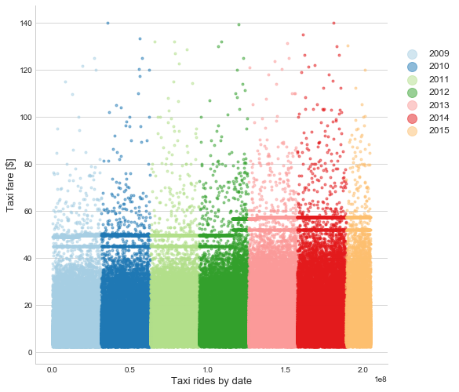

# Taxi fare prediction

This code was a part of my BA thesis which I wrote in 2019. It also is a challenge on Kaggle.com.

The subject was: "Prediction of taxi fare in New York using Python and artificial neural networks".

To run the script you will need to install few packages using pip (all packageds used are in 1st cell). You can run the script using Jupyter Notebook. 

I won't upload csv file with data because it is much too big (over 5GB). You can get it from: https://www.kaggle.com/c/new-york-city-taxi-fare-prediction.

Main packages I have used:
- pandas
- numpy
- sci-kit learn
- datetime
- matplotlib

The score I got with the model on kaggle is: 3,47 USD. The score in that competition is RMSE.

The least I got is 3,23 USD (But the structure of NN was (30,30,20,10) so it took more time to build that model)

#### I could get better score by:
- using more than 5 mil records (but I don't have good enough PC)
- exploring data further and take out more informations from there (maybe separate rides to and from airports)
- trying with other types of models and different structures of layers in MLP

### Some charts I made while doing analysis and building model:
<h4 align="center">Start and end locations of rides</h4>

  

<h4 align="center">Analysing rides from and to airports in NYC</h4>

    

<h4 align="center">Taxi fare depending on date of the ride</h4>

   

For more go to [notebook](main.ipynb).